# Tài liệu luồng hoạt động web MotoSales Commerce Platform

Tài liệu này mô tả chi tiết các luồng chính của website bán xe máy MotoSales để dùng làm cơ sở thuyết trình, làm slide, bảo vệ đồ án hoặc giải thích kiến trúc hệ thống.

## 1. Tổng quan hệ thống

MotoSales Commerce Platform là một website thương mại điện tử cho showroom xe máy. Hệ thống hỗ trợ khách hàng xem sản phẩm, lọc sản phẩm, xem chi tiết, thêm vào giỏ hàng, đặt lịch tại showroom, thanh toán qua VNPay, nhận email xác nhận và theo dõi đơn hàng. Phía quản trị viên có thể quản lý sản phẩm, thương hiệu, đơn hàng, người dùng và theo dõi dashboard.

Các nhóm chức năng chính:

- Khách hàng: đăng ký, đăng nhập, đăng nhập Google, xem sản phẩm, giỏ hàng, checkout, thanh toán, lịch sử đơn hàng, hồ sơ cá nhân.
- Quản trị viên: dashboard, quản lý sản phẩm, quản lý thương hiệu, quản lý đơn hàng, quản lý người dùng.
- Tích hợp ngoài: Google OAuth, Gmail SMTP, VNPay Sandbox.
- Tính năng realtime: thông báo đơn hàng mới cho admin và thông báo cho người dùng qua WebSocket.

## 2. Công nghệ sử dụng

| Thành phần | Công nghệ |
| --- | --- |
| Backend | Java Servlet, Java Service Layer, DAO Pattern |
| Frontend | JSP, JSTL, HTML, CSS, JavaScript, Bootstrap |
| Server | Apache Tomcat |
| Database | SQL Server |
| Kết nối DB | Microsoft SQL Server JDBC Driver |
| Authentication | Session Authentication, Google OAuth 2.0 |
| Payment | VNPay Sandbox |
| Email | JavaMail qua Gmail SMTP |
| Realtime | Java WebSocket |
| IDE/build | NetBeans, Ant |

## 3. Kiến trúc tổng thể

Hệ thống được xây theo mô hình MVC có phân lớp rõ ràng:

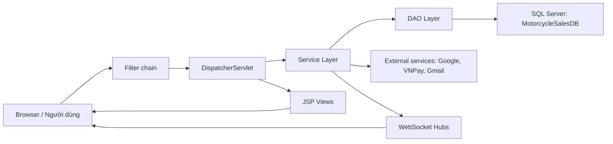

Vai trò từng lớp:

- `web/*.jsp`: giao diện hiển thị cho người dùng và admin.
- `DispatcherServlet.java`: controller trung tâm, nhận request và điều hướng tới đúng hàm xử lý.
- `service/*Service.java`: xử lý nghiệp vụ như đăng nhập, tạo đơn, thanh toán, thông báo.
- `dao/*Dao.java`: truy vấn SQL Server bằng JDBC.
- `model/*.java`: lớp dữ liệu đại diện cho bảng trong database.
- `filter/*.java`: xử lý encoding, ngôn ngữ, CSRF, đăng nhập, phân quyền.
- `websocket/*.java`: gửi cập nhật realtime cho admin và người dùng.

## 4. Cấu trúc thư mục quan trọng

```text
web bán xe máy/
├── database/
│   ├── schema.sql
│   ├── seed.sql
│   ├── fix_encoding_data.sql
│   └── update_media_assets.sql
├── src/java/com/motorcycle/
│   ├── dao/
│   ├── filter/
│   ├── model/
│   ├── service/
│   ├── util/
│   ├── web/
│   │   └── DispatcherServlet.java
│   └── websocket/
├── web/
│   ├── admin/
│   ├── assets/
│   ├── common/
│   ├── WEB-INF/
│   │   └── web.xml
│   ├── home.jsp
│   ├── products.jsp
│   ├── product-detail.jsp
│   ├── cart.jsp
│   ├── checkout.jsp
│   ├── order-history.jsp
│   ├── profile.jsp
│   ├── login.jsp
│   └── register.jsp
└── README.md
```

## 5. Database

Database chính: `MotorcycleSalesDB`.

Các bảng chính:

| Bảng | Vai trò |
| --- | --- |
| `roles` | Lưu vai trò người dùng: Admin, Customer |
| `users` | Lưu tài khoản, thông tin cá nhân, mật khẩu hash, avatar, role |
| `brands` | Lưu thương hiệu xe/phụ kiện |
| `categories` | Lưu danh mục sản phẩm |
| `products` | Lưu sản phẩm, giá, tồn kho, thông số, ảnh |
| `orders` | Lưu đơn hàng/lịch đặt showroom |
| `order_details` | Lưu từng dòng sản phẩm trong đơn |
| `payments` | Lưu giao dịch thanh toán |
| `vouchers` | Lưu mã giảm giá |
| `reviews` | Lưu đánh giá sản phẩm |
| `notifications` | Lưu thông báo của người dùng/admin |

Quan hệ dữ liệu chính:

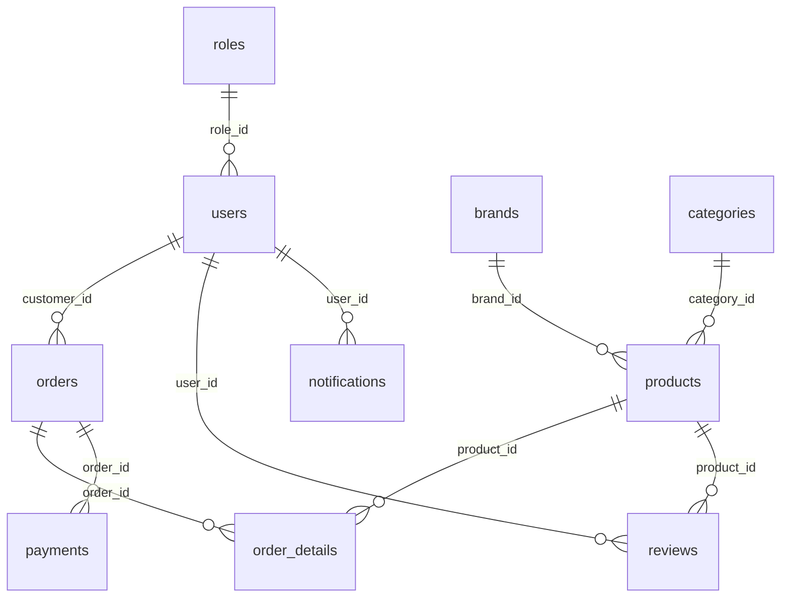

Kết nối database nằm trong `DatabaseConnection.java`. Ứng dụng ưu tiên đọc cấu hình từ Java system properties hoặc environment variables:

```text
DB_URL=jdbc:sqlserver://localhost:49679;databaseName=MotorcycleSalesDB;encrypt=true;trustServerCertificate=true
DB_USER=motorcycle_app
DB_PASSWORD=Motorcycle@123
```

## 6. Filter chain trước khi vào controller

Mọi request đi qua các filter được khai báo trong `web/WEB-INF/web.xml`.

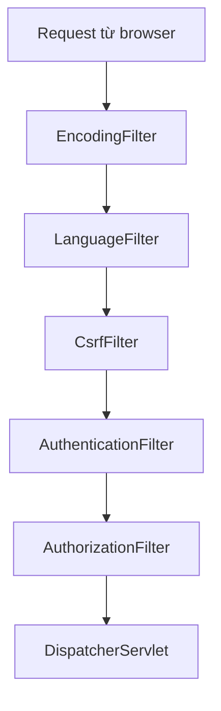

Chi tiết:

- `EncodingFilter`: đảm bảo request/response dùng UTF-8.
- `LanguageFilter`: lưu ngôn ngữ `vi` hoặc `en` trong session.
- `CsrfFilter`: tạo `csrfToken` trong session, kiểm tra token khi request POST có gửi token.
- `AuthenticationFilter`: bắt buộc đăng nhập với các URL như `/profile`, `/checkout`, `/order-history`, `/order-detail`, `/admin`.
- `AuthorizationFilter`: chặn `/admin/*` nếu user không phải admin.

## 7. Controller trung tâm

Tất cả route nghiệp vụ chính đi qua `DispatcherServlet`. Servlet đọc `request.getServletPath()` và gọi đúng hàm xử lý.

| Route | Method | Chức năng |
| --- | --- | --- |
| `/home` | GET | Trang chủ, sản phẩm nổi bật, thương hiệu |
| `/login` | GET/POST | Hiển thị form đăng nhập, xử lý đăng nhập |
| `/logout` | GET | Đăng xuất |
| `/register` | GET/POST | Đăng ký tài khoản |
| `/forgot-password` | GET/POST | Tạo token quên mật khẩu |
| `/reset-password` | GET/POST | Đổi mật khẩu bằng token |
| `/google-login` | GET | Điều hướng sang Google OAuth |
| `/google-callback` | GET | Nhận callback từ Google |
| `/products` | GET | Danh sách và lọc sản phẩm |
| `/price-list` | GET | Bảng giá sản phẩm |
| `/dealers` | GET | Trang đại lý/showroom |
| `/product-detail?id=` | GET | Chi tiết sản phẩm |
| `/cart` | GET/POST | Xem giỏ, thêm sản phẩm, xóa giỏ |
| `/checkout` | GET/POST | Đặt hàng, chọn showroom, chọn thanh toán |
| `/order-history` | GET | Lịch sử đơn hàng |
| `/order-detail?id=` | GET | Chi tiết đơn hàng |
| `/profile` | GET | Hồ sơ cá nhân |
| `/profile/update` | POST | Cập nhật hồ sơ |
| `/profile/change-password` | POST | Đổi mật khẩu |
| `/notifications` | GET | Lấy thông báo dạng JSON |
| `/notifications/read` | POST/GET | Đánh dấu đã đọc |
| `/admin/dashboard` | GET | Dashboard admin |
| `/admin/manage-product` | GET/POST | Quản lý sản phẩm |
| `/admin/manage-brand` | GET/POST | Quản lý thương hiệu |
| `/admin/manage-order` | GET/POST | Quản lý đơn hàng |
| `/admin/manage-user` | GET/POST | Quản lý người dùng |
| `/payment/callback` | GET | Nhận kết quả thanh toán VNPay |

## 8. Luồng trang chủ

Mục tiêu: giới thiệu website, hiển thị sản phẩm nổi bật và thương hiệu.

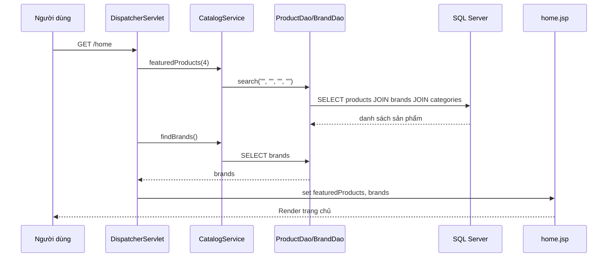

Dữ liệu hiển thị:

- Sản phẩm nổi bật: lấy 4 sản phẩm đầu tiên từ danh sách sản phẩm active.
- Thương hiệu: lấy từ bảng `brands`.
- Số lượng giỏ hàng: lấy từ session thông qua `CartService.itemCount()`.

## 9. Luồng danh mục sản phẩm và tìm kiếm

Mục tiêu: cho phép người dùng duyệt sản phẩm, tìm theo từ khóa, lọc theo hãng, danh mục và giá.

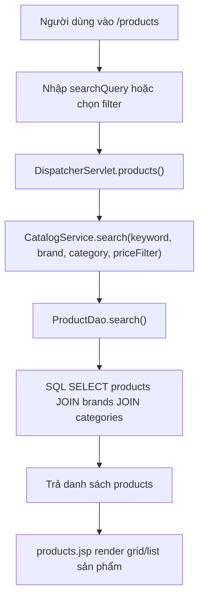

Các filter sản phẩm:

- `searchQuery`: tìm theo tên, SKU hoặc mô tả.
- `brand`: lọc chính xác theo tên thương hiệu.
- `category`: lọc chính xác theo tên danh mục.
- `priceFilter`:
  - `under_300`: dưới 300 triệu.
  - `300_500`: từ 300 đến 500 triệu.
  - `over_500`: trên 500 triệu.

Điểm kỹ thuật:

- DAO dùng `PreparedStatement`, tránh nối trực tiếp input người dùng vào SQL.
- Chỉ hiển thị sản phẩm có `is_active = 1`.
- Sắp xếp theo giá giảm dần.

## 10. Luồng xem chi tiết sản phẩm

Mục tiêu: người dùng xem đầy đủ thông tin một sản phẩm trước khi thêm vào giỏ.

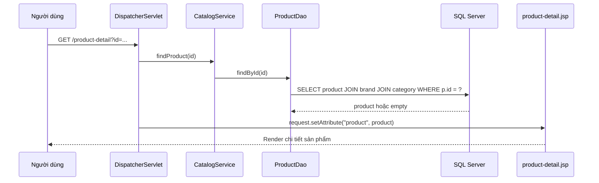

Thông tin sản phẩm thường gồm:

- Tên sản phẩm, SKU.
- Thương hiệu, danh mục.
- Giá bán, tồn kho.
- Dung tích, công suất, trọng lượng.
- Ảnh sản phẩm, mô tả.
- Tùy chọn màu và số lượng để thêm vào giỏ.

## 11. Luồng giỏ hàng

Giỏ hàng được lưu trong session, không lưu trực tiếp vào database. Key session là `cartItems`.

### 11.1 Thêm sản phẩm vào giỏ

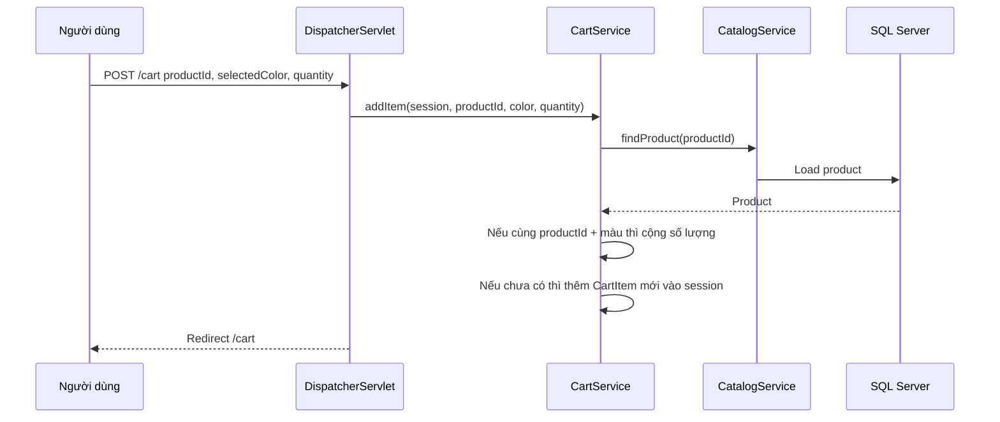

Quy tắc:

- Nếu sản phẩm đã có trong giỏ với cùng màu, hệ thống cộng thêm số lượng.
- Nếu chưa có, tạo `CartItem` mới.
- Số lượng tối thiểu là 1.
- Nếu màu rỗng, mặc định là `Ducati Red`.

### 11.2 Xem giỏ hàng

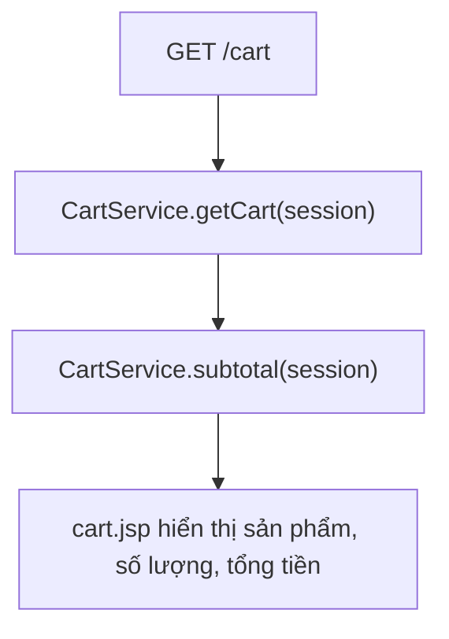

### 11.3 Xóa giỏ hàng

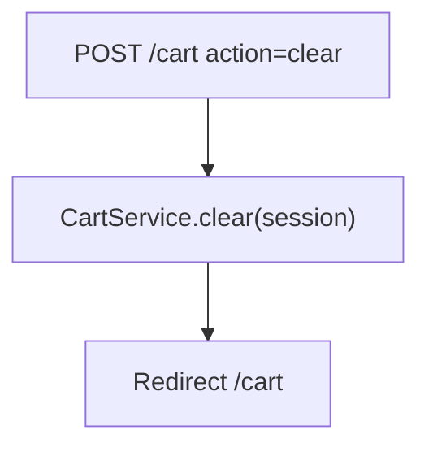

## 12. Luồng checkout và tạo đơn hàng

Mục tiêu: chuyển giỏ hàng thành đơn hàng, lưu đơn vào database, gửi thông báo và email.

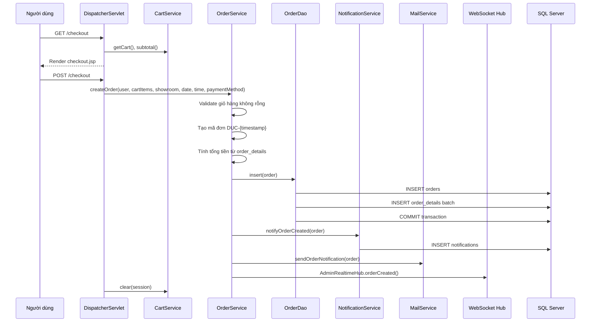

Thông tin đơn hàng:

- `code`: mã đơn dạng `DUC-{timestamp}`.
- `customer_id`: user đang đăng nhập.
- `showroom`: showroom khách chọn.
- `appointment_date`: ngày hẹn.
- `appointment_time`: khung giờ hẹn.
- `payment_method`: phương thức thanh toán.
- `status`: trạng thái mặc định từ model/database.
- `total`: tổng tiền.
- `order_details`: danh sách sản phẩm, màu, số lượng, đơn giá.

Lưu ý quan trọng:

- `/checkout` được bảo vệ bởi `AuthenticationFilter`, user phải đăng nhập.
- Trong controller vẫn có đoạn tự tạo user nếu session chưa có user, nhưng bình thường filter đã chặn trường hợp chưa đăng nhập.
- Sau khi tạo đơn, giỏ hàng trong session được xóa.

## 13. Luồng thanh toán VNPay

Nếu người dùng chọn phương thức thanh toán `VNPay`, hệ thống sẽ chuyển sang VNPay Sandbox.

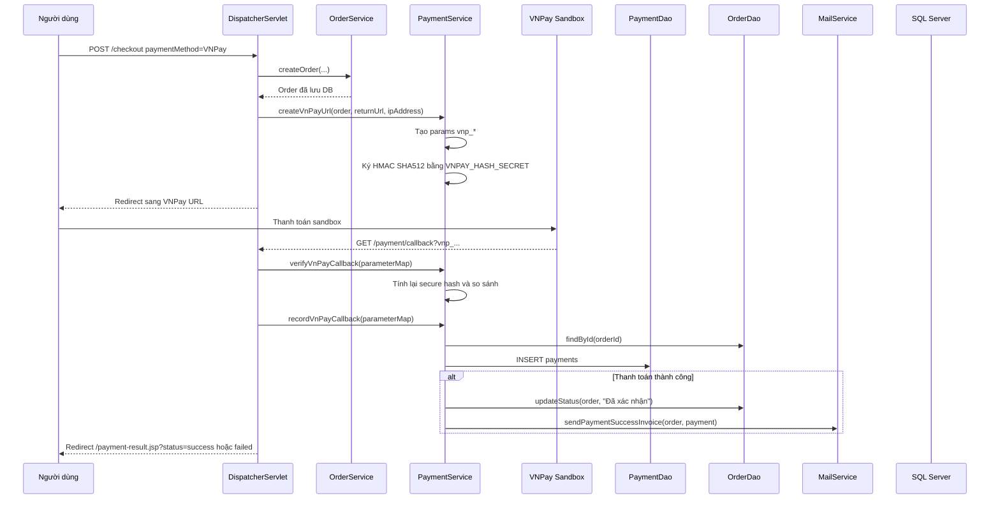

Các tham số VNPay quan trọng:

- `vnp_TmnCode`: mã merchant.
- `vnp_Amount`: tổng tiền nhân 100.
- `vnp_TxnRef`: id đơn hàng.
- `vnp_OrderInfo`: mô tả thanh toán.
- `vnp_ReturnUrl`: URL callback về website.
- `vnp_IpAddr`: IP người dùng.
- `vnp_CreateDate`: thời gian tạo.
- `vnp_ExpireDate`: thời gian hết hạn.
- `vnp_SecureHash`: chữ ký bảo mật.

Kết quả:

- Nếu callback hợp lệ và `vnp_ResponseCode = 00`, payment có status `SUCCESS`.
- Đơn hàng được đổi trạng thái thành `Đã xác nhận`.
- Hệ thống gửi email hóa đơn thanh toán thành công.
- Người dùng được đưa về trang kết quả thanh toán.

## 14. Luồng đăng ký tài khoản

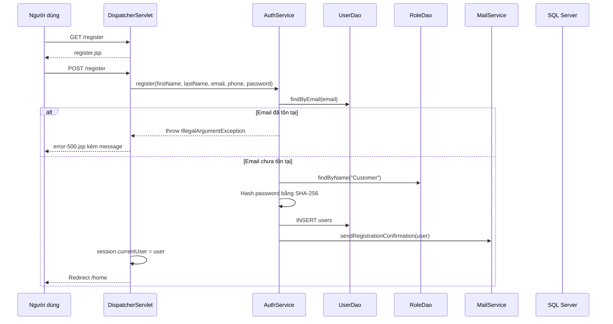

Dữ liệu được lưu:

- Họ tên, email, số điện thoại.
- Mật khẩu đã hash, không lưu mật khẩu plaintext.
- Role mặc định là `Customer`.
- Trạng thái active.

## 15. Luồng đăng nhập thường

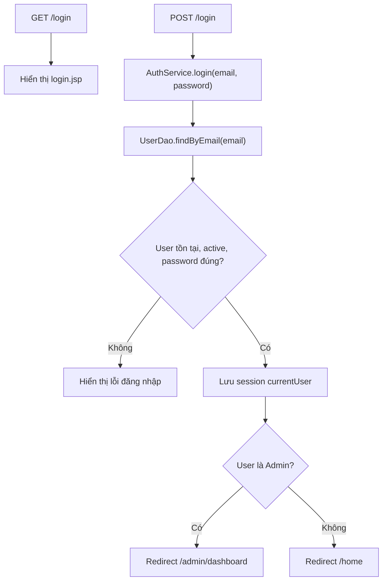

Session chính:

```text
currentUser = User đang đăng nhập
```

## 16. Luồng đăng nhập bằng Google OAuth

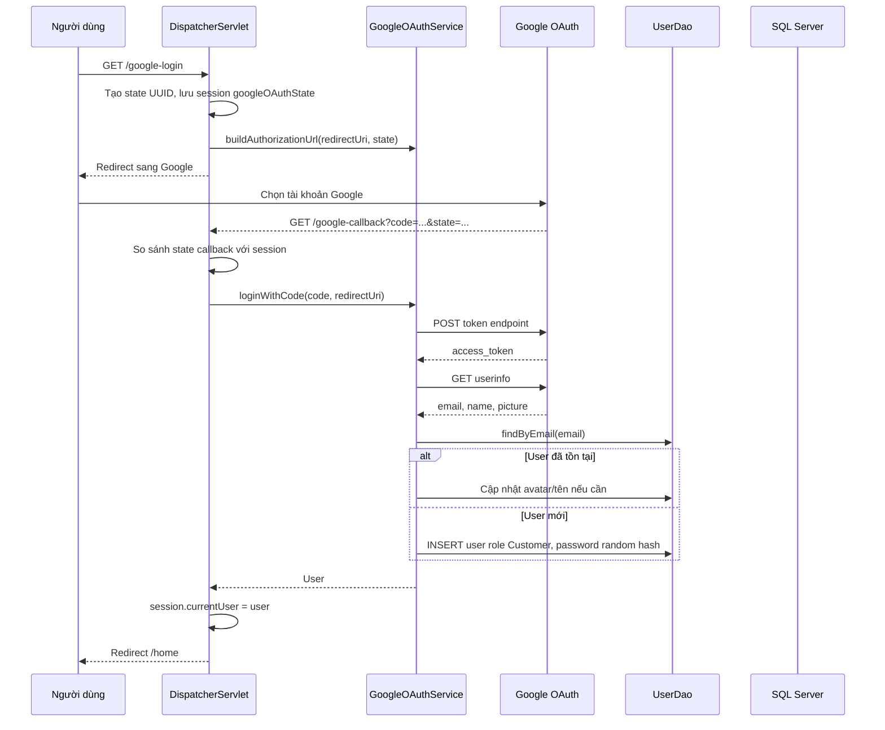

Điểm bảo mật:

- Dùng `state` để giảm rủi ro CSRF OAuth.
- Client ID và Client Secret không hardcode trong source, đọc từ biến môi trường:

```text
GOOGLE_CLIENT_ID=...
GOOGLE_CLIENT_SECRET=...
```

## 17. Luồng quên mật khẩu và đặt lại mật khẩu

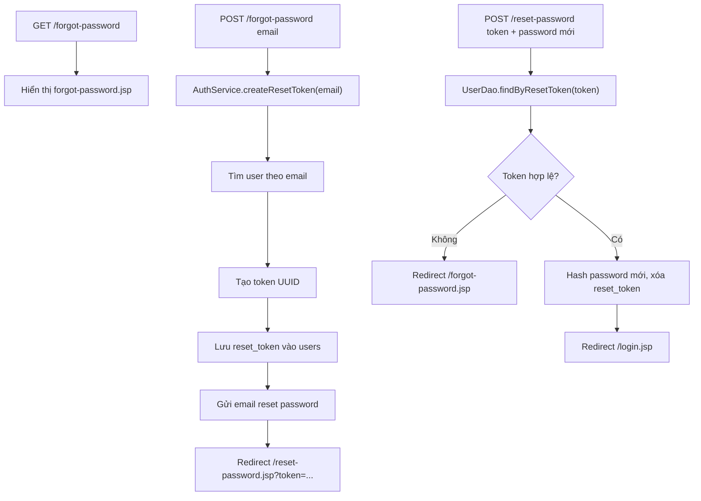

## 18. Luồng hồ sơ cá nhân

`/profile` yêu cầu người dùng đăng nhập.

Chức năng:

- Xem thông tin cá nhân.
- Cập nhật họ tên, số điện thoại, địa chỉ.
- Đổi mật khẩu.
- Nếu user là admin, trang profile cũng chuẩn bị thêm dữ liệu dashboard.

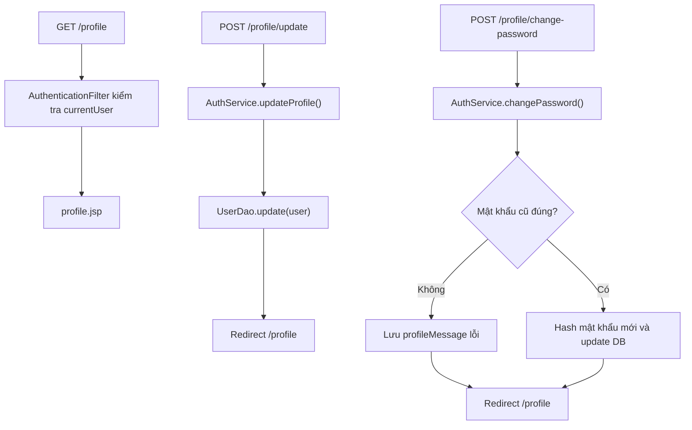

## 19. Luồng lịch sử đơn hàng và chi tiết đơn

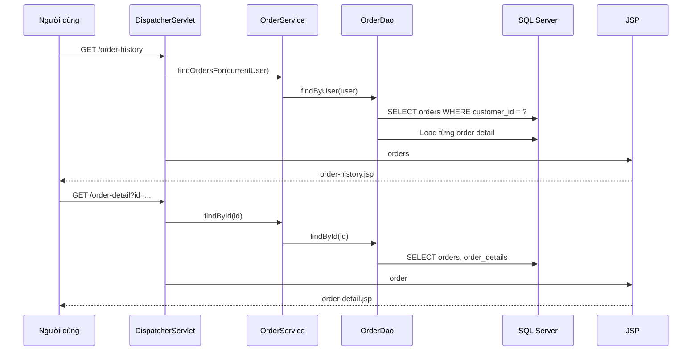

Dữ liệu hiển thị:

- Mã đơn hàng.
- Ngày đặt.
- Showroom và lịch hẹn.
- Sản phẩm trong đơn.
- Tổng tiền.
- Trạng thái đơn.
- Phương thức thanh toán.

## 20. Luồng thông báo

Hệ thống có 2 cách lấy thông báo:

- REST-like JSON endpoint: `/notifications`.
- Realtime qua WebSocket: `NotificationRealtimeHub`.

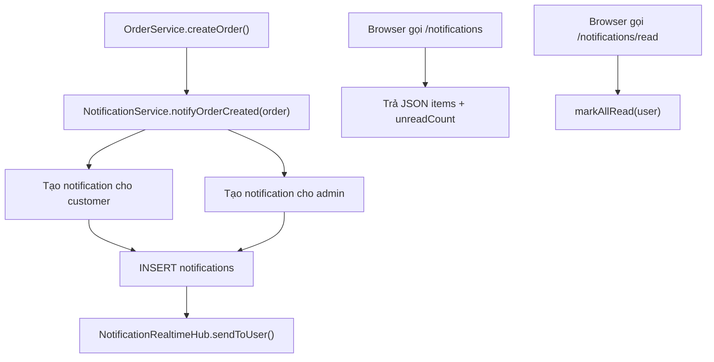

Khi đơn mới được tạo:

- Khách hàng nhận thông báo đặt lịch thành công.
- Admin nhận thông báo có đơn đặt lịch mới.
- Nếu WebSocket đang mở, thông báo được đẩy realtime.
- Nếu không realtime, frontend vẫn có thể gọi `/notifications` để lấy danh sách.

## 21. Luồng admin dashboard

Dashboard lấy dữ liệu thật từ database thông qua danh sách sản phẩm và đơn hàng.

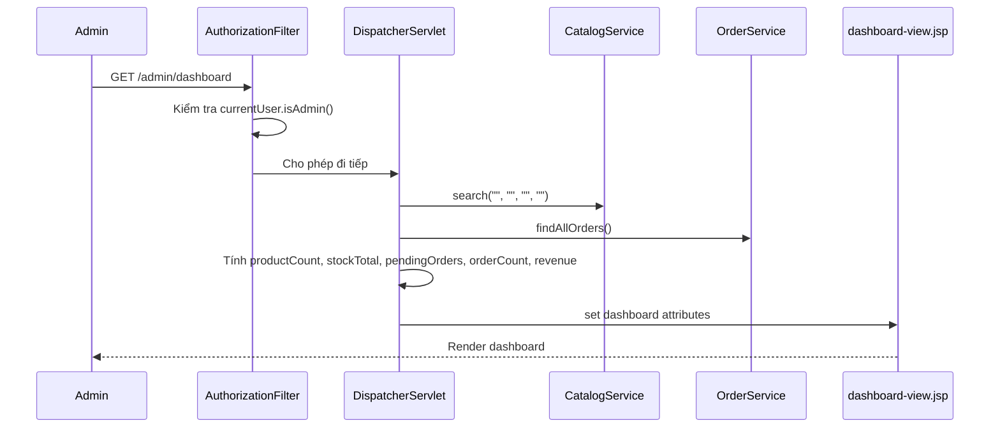

Chỉ số dashboard:

- `productCount`: số sản phẩm active.
- `stockTotal`: tổng tồn kho.
- `pendingOrders`: số đơn đang chờ/xử lý.
- `orderCount`: tổng số đơn.
- `dashboardRevenue`: tổng doanh thu từ các đơn.
- `topProducts`: tối đa 6 sản phẩm.
- `recentOrders`: tối đa 8 đơn mới nhất.
- `bookedByProduct`: số lượng đã được đặt theo từng sản phẩm.

## 22. Luồng quản lý sản phẩm

Route: `/admin/manage-product`.

Quyền truy cập: chỉ Admin.

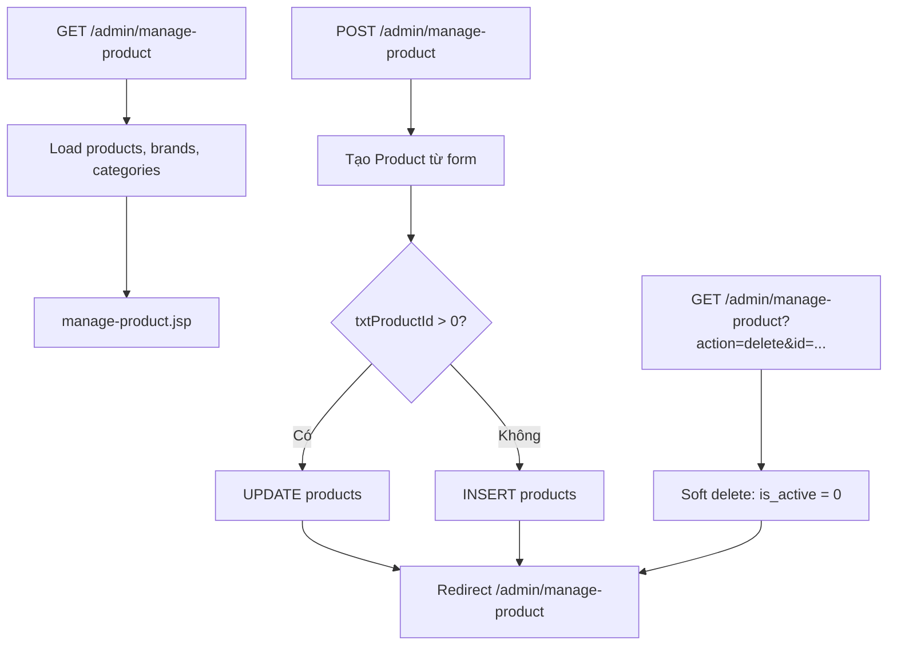

Các trường xử lý:

- `txtProductId`
- `txtProductName`
- `txtSku`
- `txtBrandId`
- `txtCategoryId`
- `txtPrice`
- `txtStock`
- `txtDisplacement`
- `txtHorsepower`
- `txtWeight`

Điểm đáng nói khi thuyết trình:

- Xóa sản phẩm là soft delete, không xóa vật lý khỏi database.
- ProductDao chỉ hiển thị sản phẩm `is_active = 1`.
- Thương hiệu và danh mục được load để admin chọn khi thêm/sửa sản phẩm.

## 23. Luồng quản lý thương hiệu

Route: `/admin/manage-brand`.

```mermaid
flowchart TD
    A["GET /admin/manage-brand"] --> B["BrandDao.findAll()"]
    B --> C["manage-brand.jsp"]
    D["POST /admin/manage-brand"] --> E["Tạo Brand từ form"]
    E --> F{"txtBrandId > 0?"}
    F -- "Có" --> G["UPDATE brands"]
    F -- "Không" --> H["INSERT brands"]
    G --> I["Redirect /admin/manage-brand"]
    H --> I
    J["GET action=delete&id=..."] --> K["DELETE brand"]
    K --> I
```

Dữ liệu thương hiệu:

- Tên thương hiệu.
- Xuất xứ.
- URL logo.

## 24. Luồng quản lý đơn hàng

Route: `/admin/manage-order`.

```mermaid
sequenceDiagram
    participant A as Admin
    participant C as DispatcherServlet
    participant OS as OrderService
    participant OD as OrderDao
    participant WS as AdminRealtimeHub
    participant DB as SQL Server

    A->>C: GET /admin/manage-order
    C->>OS: findAllOrders()
    OS->>OD: findByUser(admin)
    OD->>DB: SELECT tất cả orders
    C-->>A: manage-order.jsp

    A->>C: POST /admin/manage-order orderId, txtOrderStatus
    C->>OS: updateStatus(orderId, status)
    OS->>OD: UPDATE orders SET status = ?
    OS->>OD: findById(orderId)
    OS->>WS: orderStatusUpdated(order, allOrders)
    C-->>A: Redirect /admin/manage-order
```

Mục đích:

- Admin xem toàn bộ đơn hàng.
- Admin cập nhật trạng thái xử lý.
- Dashboard realtime nhận sự kiện `ORDER_STATUS_UPDATED`.

## 25. Luồng quản lý người dùng

Route: `/admin/manage-user`.

```mermaid
flowchart TD
    A["GET /admin/manage-user"] --> B["AdminService.findUsers()"]
    B --> C["UserDao.findAll()"]
    C --> D["manage-user.jsp"]
    E["POST /admin/manage-user"] --> F["AdminService.updateRole(accountId, txtRole)"]
    F --> G["RoleDao.findByName(roleName)"]
    G --> H["UserDao.updateRole(accountId, roleId)"]
    H --> I["Redirect /admin/manage-user"]
```

Mục đích:

- Xem danh sách tài khoản.
- Thay đổi vai trò người dùng.
- Tài khoản có role Admin được phép vào `/admin/*`.

## 26. Luồng phân quyền

```mermaid
flowchart TD
    A["Request URL"] --> B{"URL cần đăng nhập?"}
    B -- "Không" --> C["Cho qua"]
    B -- "Có" --> D{"Session có currentUser?"}
    D -- "Không" --> E["Redirect /login.jsp"]
    D -- "Có" --> F{"URL bắt đầu /admin?"}
    F -- "Không" --> C
    F -- "Có" --> G{"currentUser.isAdmin()?"}
    G -- "Không" --> H["403 Forbidden"]
    G -- "Có" --> C
```

Các URL bắt buộc đăng nhập:

- `/profile`
- `/checkout`
- `/order-history`
- `/order-detail`
- `/admin`

Các URL bắt buộc là admin:

- Mọi URL bắt đầu bằng `/admin`.

## 27. Luồng email

Email được xử lý bởi `MailService`.

Các thời điểm gửi email:

- Sau khi đăng ký thành công: gửi email xác nhận đăng ký.
- Khi quên mật khẩu: gửi email reset password.
- Sau khi tạo đơn: gửi email thông báo đơn hàng.
- Sau khi thanh toán thành công: gửi email hóa đơn.

Cấu hình:

```text
MAIL_HOST=smtp.gmail.com
MAIL_PORT=587
MAIL_USERNAME=your-gmail@gmail.com
MAIL_PASSWORD=your-google-app-password
MAIL_FROM=your-gmail@gmail.com
```

Điểm thuyết trình:

- Không hardcode tài khoản email trong code.
- Dùng Gmail App Password.
- Email HTML hỗ trợ UTF-8 để hiển thị tiếng Việt.

## 28. Luồng realtime WebSocket

Hệ thống có 2 hub chính:

- `AdminRealtimeHub`: gửi sự kiện đơn mới và cập nhật trạng thái đơn cho admin dashboard.
- `NotificationRealtimeHub`: gửi thông báo cho từng user.

```mermaid
flowchart TD
    A["Khách tạo đơn"] --> B["OrderService.createOrder()"]
    B --> C["AdminRealtimeHub.orderCreated()"]
    B --> D["NotificationRealtimeHub.sendToUser(customer/admin)"]
    C --> E["Admin dashboard cập nhật số liệu"]
    D --> F["Header/notification widget nhận thông báo"]
    G["Admin đổi trạng thái đơn"] --> H["OrderService.updateStatus()"]
    H --> I["AdminRealtimeHub.orderStatusUpdated()"]
    I --> E
```

Payload admin gồm:

- `type`: `ORDER_CREATED` hoặc `ORDER_STATUS_UPDATED`.
- `order`: id, code, customer, status, total.
- `stats`: orderCount, pendingOrders, dashboardRevenue.

## 29. Luồng lỗi

Các trang lỗi được cấu hình trong `web.xml`:

| Mã lỗi | Trang |
| --- | --- |
| 403 | `/error-403.jsp` |
| 404 | `/error-404.jsp` |
| 500 | `/error-500.jsp` |

Trường hợp thường gặp:

- 403: user thường truy cập admin.
- 404: route không tồn tại.
- 500: lỗi nghiệp vụ hoặc lỗi database được throw ra.

## 30. Các điểm nổi bật để đưa vào slide

Có thể nhấn mạnh các điểm sau khi thuyết trình:

1. Hệ thống xây theo mô hình MVC, dễ bảo trì.
2. Controller tập trung trong `DispatcherServlet`, route rõ ràng.
3. Service Layer tách nghiệp vụ khỏi controller.
4. DAO dùng JDBC và `PreparedStatement` để truy vấn an toàn.
5. Giỏ hàng lưu trong session giúp thao tác nhanh, chưa cần ghi DB trước checkout.
6. Checkout tạo transaction gồm `orders` và `order_details`.
7. VNPay được ký bằng HMAC SHA512 và verify callback.
8. Google OAuth giúp đăng nhập nhanh bằng Gmail.
9. Gmail SMTP gửi email xác nhận, reset password và hóa đơn.
10. Admin dashboard lấy dữ liệu thật từ SQL Server.
11. WebSocket giúp admin và user nhận cập nhật realtime.
12. Filter chain xử lý encoding, ngôn ngữ, đăng nhập, phân quyền và CSRF.

## 31. Gợi ý bố cục slide thuyết trình

### Slide 1: Tên đề tài

- MotoSales Commerce Platform.
- Website bán xe máy, phụ kiện, phụ tùng và dịch vụ.
- Công nghệ: Java Servlet/JSP, SQL Server, VNPay, Google OAuth.

### Slide 2: Lý do chọn đề tài

- Nhu cầu showroom cần website giới thiệu và bán xe.
- Khách hàng cần xem sản phẩm, đặt lịch, thanh toán online.
- Admin cần quản lý sản phẩm và đơn hàng tập trung.

### Slide 3: Mục tiêu hệ thống

- Xây dựng website thương mại điện tử hoàn chỉnh.
- Tách rõ khách hàng và admin.
- Có database thật, thanh toán thật ở sandbox, email và OAuth.

### Slide 4: Công nghệ sử dụng

- Java Servlet, JSP, JSTL.
- SQL Server, JDBC.
- Tomcat, NetBeans.
- VNPay, Google OAuth, Gmail SMTP.
- WebSocket.

### Slide 5: Kiến trúc tổng thể

- Dùng sơ đồ MVC ở mục 3.
- Giải thích Browser -> Filter -> Controller -> Service -> DAO -> DB -> JSP.

### Slide 6: Database

- Dùng bảng ở mục 5.
- Trình bày các bảng chính: users, products, orders, payments.
- Dùng ERD ở mục 5 nếu slide hỗ trợ Mermaid hoặc vẽ lại.

### Slide 7: Luồng đăng nhập/đăng ký

- Trình bày session `currentUser`.
- Nêu role Customer/Admin.
- Nêu hash password.

### Slide 8: Luồng Google OAuth

- Người dùng bấm đăng nhập Google.
- Website redirect Google.
- Google callback về website.
- Tạo/cập nhật user theo email.

### Slide 9: Luồng xem và lọc sản phẩm

- Trang `/products`.
- Lọc theo keyword, brand, category, price.
- DAO query products join brands/categories.

### Slide 10: Luồng giỏ hàng

- Giỏ hàng lưu trong session.
- Thêm sản phẩm theo productId, màu, số lượng.
- Cộng dồn nếu trùng sản phẩm và màu.

### Slide 11: Luồng checkout

- Người dùng chọn showroom, ngày, giờ, phương thức thanh toán.
- Hệ thống tạo order và order_details.
- Gửi notification/email.

### Slide 12: Luồng thanh toán VNPay

- Tạo URL thanh toán.
- Ký secure hash.
- VNPay callback.
- Verify callback.
- Lưu payment và cập nhật trạng thái đơn.

### Slide 13: Luồng quản trị

- Dashboard.
- Quản lý sản phẩm.
- Quản lý thương hiệu.
- Quản lý đơn hàng.
- Quản lý người dùng.

### Slide 14: Bảo mật và phân quyền

- AuthenticationFilter.
- AuthorizationFilter.
- CSRF token.
- Không hardcode secret.
- Mật khẩu hash.

### Slide 15: Realtime và thông báo

- Admin nhận đơn mới realtime.
- User nhận notification.
- Dashboard cập nhật khi đơn đổi trạng thái.

### Slide 16: Demo kịch bản

Kịch bản demo nên đi theo thứ tự:

1. Vào trang chủ.
2. Xem danh sách sản phẩm.
3. Lọc sản phẩm.
4. Xem chi tiết sản phẩm.
5. Thêm vào giỏ hàng.
6. Checkout.
7. Thanh toán VNPay sandbox hoặc chọn phương thức khác.
8. Xem lịch sử đơn hàng.
9. Đăng nhập admin.
10. Xem dashboard và cập nhật trạng thái đơn.

### Slide 17: Kết luận

- Hệ thống hoàn thành các chức năng chính của website bán xe máy.
- Có tích hợp thanh toán, email, OAuth, realtime.
- Kiến trúc phân lớp giúp dễ mở rộng.

### Slide 18: Hướng phát triển

- Thêm quản lý voucher ở giao diện admin.
- Thêm đánh giá sản phẩm đầy đủ.
- Thêm upload ảnh sản phẩm.
- Thêm thống kê doanh thu theo tháng.
- Thêm phân quyền chi tiết hơn.
- Tối ưu bảo mật CSRF bắt buộc cho mọi POST.

## 32. Kịch bản nói mẫu ngắn gọn

"Website của nhóm em là MotoSales Commerce Platform, một hệ thống bán xe máy và phụ kiện theo mô hình Java Web MVC. Người dùng có thể đăng ký, đăng nhập, xem sản phẩm, lọc theo thương hiệu/danh mục/giá, thêm vào giỏ hàng, đặt lịch tại showroom và thanh toán qua VNPay sandbox. Sau khi đặt hàng, hệ thống lưu đơn vào SQL Server, gửi email xác nhận và tạo thông báo realtime cho admin.

Về kiến trúc, request từ trình duyệt đi qua các filter như encoding, ngôn ngữ, CSRF, authentication và authorization. Sau đó request vào DispatcherServlet, servlet gọi Service Layer để xử lý nghiệp vụ, Service gọi DAO để truy vấn SQL Server. Kết quả được forward sang JSP để render giao diện.

Phần admin có dashboard lấy dữ liệu thật từ database, gồm số sản phẩm, tổng tồn kho, số đơn chờ xử lý, tổng số đơn và doanh thu. Admin có thể quản lý sản phẩm, thương hiệu, đơn hàng và người dùng. Khi có đơn mới hoặc trạng thái đơn thay đổi, WebSocket giúp dashboard cập nhật realtime."

## 33. Checklist khi demo

- SQL Server đang chạy và có database `MotorcycleSalesDB`.
- Tomcat đã cấu hình `DB_URL`, `DB_USER`, `DB_PASSWORD`.
- Nếu demo Google OAuth, đã cấu hình `GOOGLE_CLIENT_ID`, `GOOGLE_CLIENT_SECRET`.
- Nếu demo VNPay, đã cấu hình `VNPAY_TMN_CODE`, `VNPAY_HASH_SECRET`.
- Nếu demo email, đã cấu hình Gmail App Password.
- Có tài khoản Customer và Admin để đăng nhập.
- Có sẵn sản phẩm trong bảng `products`.
- Trình duyệt mở đúng context path của Tomcat.

## 34. Tài khoản mẫu

Theo dữ liệu seed của project:

```text
Admin:    admin@ducati.local / admin123
Customer: enzo@ferrari.it    / 123456
```

## 35. Tóm tắt một câu

MotoSales là website bán xe máy Java Servlet/JSP có database SQL Server, giỏ hàng theo session, checkout tạo đơn thật, thanh toán VNPay, đăng nhập Google, gửi email, dashboard admin và thông báo realtime.
